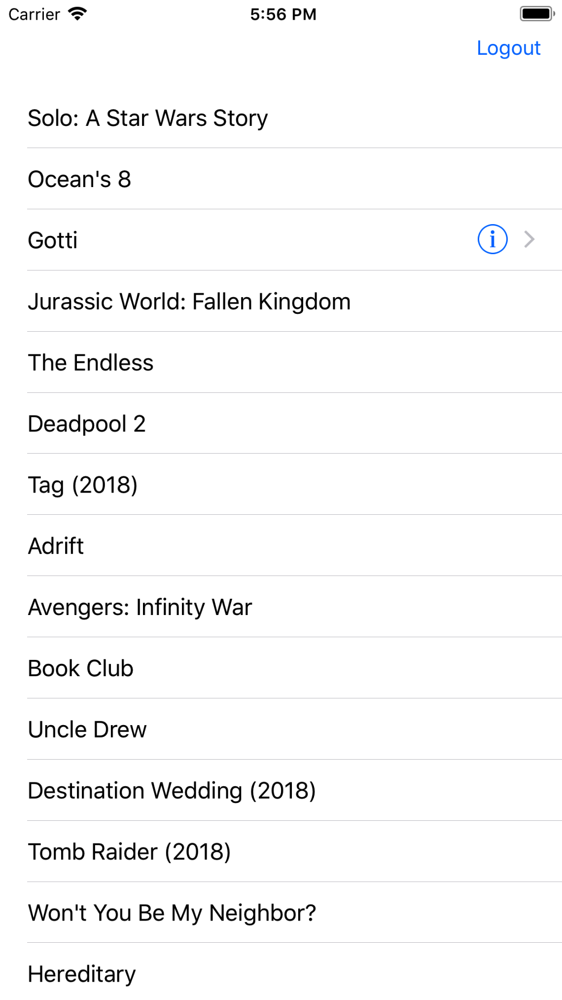

# MvvmExample

**Sample projects features:**
1) Provide login functionality using MVVM pattern.
2) Can change your validation accrodingly.
3) Sever request can be handled in viewModel.
4) Currently just a simple startup demo. Will try to improve.
5) Fetch top movies from iTunes and show them in tableView.

**Instructions**

Open MVVMExample.xcworkspace, select desired target, build and run, enjoy! :+1:

**ScreenShots:**

